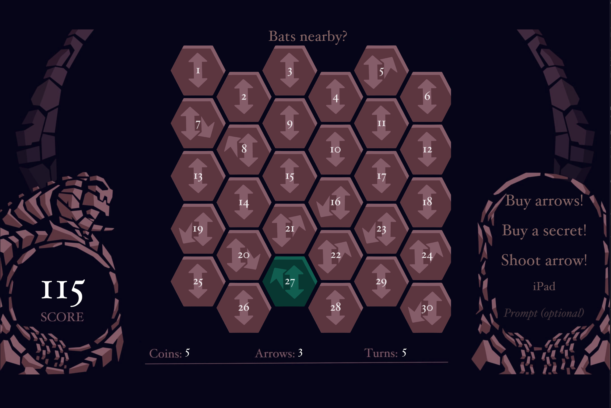
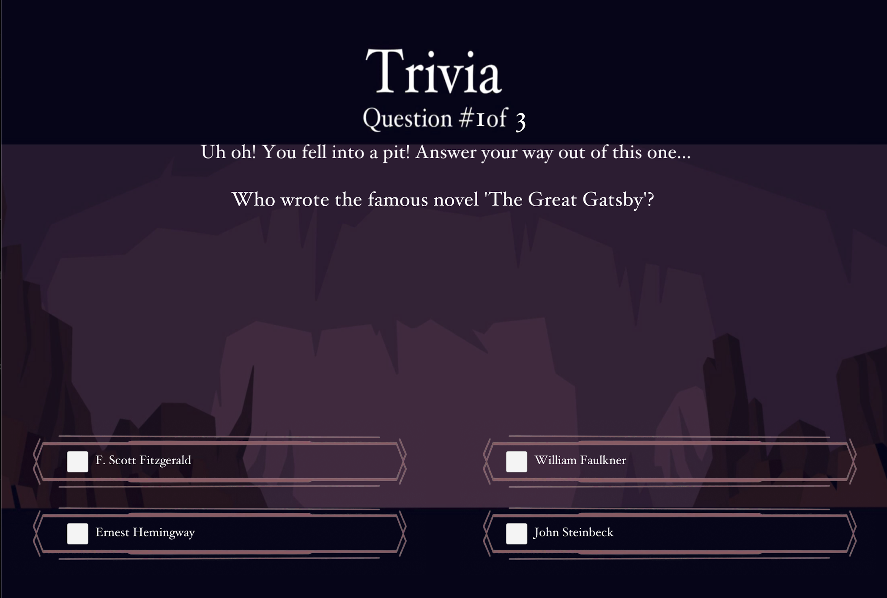

# Hunt the Wumpus — AI Edition

A Unity remake of the 1973 cave game *Hunt the Wumpus*, with one change: hazards don't kill you
outright, they start a trivia duel. A language model writes the question on the spot, and answering
it is how you climb out of the pit or drive the monster off.

You're dropped into a 30-room hex cave holding a Wumpus, two pits and two colonies of bats. You
can't see any of it — you only sense what's in the rooms next to you ("I smell a wumpus!", "I feel a
breeze..."). From those clues you work out where the Wumpus is and shoot it before it finds you.

## Play it

**[mallard64.github.io/Wumpus](https://mallard64.github.io/Wumpus/)** — runs in the browser, nothing
to install.

> The link goes live after the first successful run of the WebGL workflow. See
> [Deploying](#deploying) for the one-time setup.

## Screenshots

| | |
|---|---|
|  |  |
| The hex map. Colour tells you about the room you're in, text about the rooms next to it. | An AI-generated trivia encounter. |

## How it works

The cave lives in one scene that stays loaded for the whole run. When you hit a hazard, the
encounter loads *on top* of it as a second scene and reports its result back. That way the cave
never has to be saved and rebuilt mid-game.

```
  BeginningScene ──▶ MainScene ────────────────────────────────┐
   (intro crawl)      │                                        │
                      │  CellGenerator ──builds──▶ Cell[6,5]   │
                      │        │                       ▲       │
                      │        │ owns wumpus, pits,    │       │
                      │        │ bats                  │       │
                      │        ▼                       │       │
                      │  PlayerScript ──reads/moves────┘       │
                      └────────┬───────────────────────────────┘
                               │ LoadScene(Additive)
                               ▼
                 ┌───────────────────────────┐
                 │  Cave_01..04 / wumpusRoom │
                 │                           │
                 │  TriviaDisplay ──▶ OpenAIClient ──▶ OpenAI API
                 │         │                 │              │
                 └─────────┼─────────────────┘              ▼
                           │                        offline fallback:
           SendMessage("CorrectAnswer"/"WrongAnswer")   newdata.json
                           │
                           ▼
                     PlayerScript ──▶ GameData ──▶ leaderboard
```

Two details worth knowing:

- **Every room keeps two neighbour maps.** `neighbors` is the tunnels you can walk through;
  `next` is the raw hex adjacency. Arrows and the Wumpus use `next`, which is why an arrow can fly
  through rock but you can't walk there. The grid wraps at the edges, so there are no dead ends.
- **The API is treated as unreliable, not as a library.** Questions come back as
  schema-constrained JSON, get validated, and are retried once. Anything that still fails falls back
  to a bank of previously seen questions on disk, so the game is fully playable offline and with no
  API key at all.

## Stack

Unity 2022.3 (2D, built-in pipeline) · C# · UGUI + TextMeshPro · `UnityWebRequest` coroutines ·
OpenAI chat completions with structured outputs · `JsonUtility` for saves. No paid assets or
third-party plugins.

## Run it locally

```bash
git clone https://github.com/Mallard64/Wumpus.git
cd Wumpus
```

Open the folder in Unity Hub (2022.3.32f1), open `Assets/Scenes/BeginningScene.unity`, and press
**Play**. First import takes a few minutes.

The AI features are optional. Without a key the game runs off its offline question bank; everything
else works the same. To turn live generation on:

```bash
cp "Assets/Resources/openai_api_key.txt.example" "Assets/Resources/openai_api_key.txt"
# paste your key into that file — it is git-ignored
```

`OpenAIClient` also reads `OPENAI_API_KEY` from the environment if no key file is present.

**Tests:** *Window → General → Test Runner → EditMode → Run All*, or headless:

```bash
Unity -runTests -batchmode -projectPath . -testPlatform EditMode -testResults results.xml
```

## Deploying

`.github/workflows/webgl.yml` runs the tests, builds WebGL and publishes to GitHub Pages on every
push to `master`. Pull requests run `.github/workflows/tests.yml` instead, which runs the EditMode
tests on their own so a PR isn't waiting on a full WebGL build. Two one-time setup steps:

1. **Settings → Pages → Source: GitHub Actions.**
2. Add these repository secrets (Settings → Secrets and variables → Actions):

   | Secret | What it is |
   |---|---|
   | `UNITY_LICENSE` | Contents of your `.ulf` license file — see [game-ci activation](https://game.ci/docs/github/activation) |
   | `UNITY_EMAIL` | The email on your Unity account |
   | `UNITY_PASSWORD` | That account's password |

## Team & my role

This was a two-person student project. I wrote the gameplay and AI layer — hex cave generation and
room numbering (`CellGenerator`, `Cell`), player movement and arrow rules (`PlayerScript`), the
trivia encounter and its OpenAI integration (`TriviaDisplay`, `OpenAIClient`), and scoring and
persistence (`GameData`, `Leaderboard`) — plus the four cave scenes and the UI art pass.

[zigoola](https://github.com/zigoola) did the iOS port — build target, app icons, splash screen,
landscape orientation and signing — along with touch controls for shooting, the developer test-mode
shortcuts, several Unity scene layout fixes, a Unity version upgrade, and a cleanup pass that
removed four dead scripts.

Since June 2024 I've maintained it alone: removing the hardcoded API keys, rewriting the OpenAI
client to validate responses and fall back to an offline question bank, and adding the EditMode test
suite and the WebGL CI pipeline.

Commit counts are 14 from zigoola and 9 from me, which undersells neither of us: his are small and
targeted, mine include the initial project import and the later refactors.

## Limits

This is a finished student project, not a shipped product. Cave size, hazard count and arrow count
are compile-time constants rather than difficulty settings, and each trivia question costs an API
round trip, so there's a short pause at the start of an encounter.

## Credits

Built with Unity. The original *Hunt the Wumpus* was designed by Gregory Yob in 1973.
